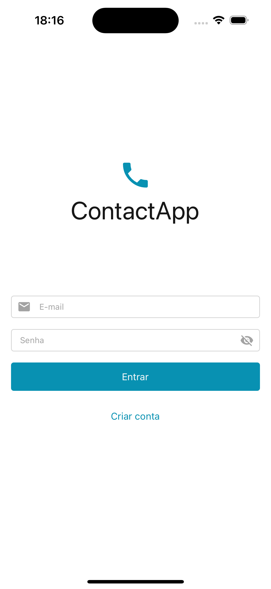
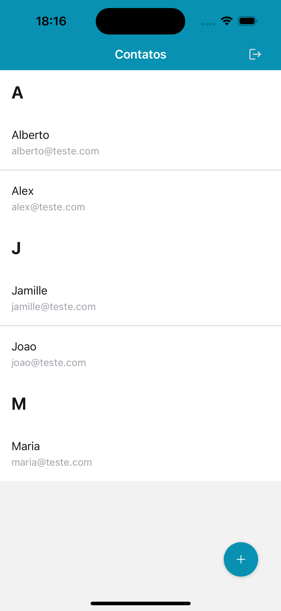
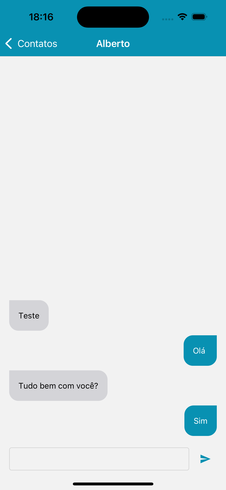

# ContactApp

Bem-vindo ao ContactApp! Este é um aplicativo de chat desenvolvido com Expo, permitindo que você se conecte e converse com seus contatos de forma rápida e fácil.

<div style="display: flex; justify-content: space-around;">
   
   
   
</div>


## Índice

- [Descrição](#descrição)
- [Recursos](#recursos)
- [Instalação](#instalação)
- [Como Usar](#como-usar)
- [Tecnologias Utilizadas](#tecnologias-utilizadas)
- [Contribuição](#contribuição)
- [Licença](#licença)
- [Contato](#contato)

## Descrição

O ContactApp é um aplicativo móvel de mensagens instantâneas que permite que você se conecte com seus amigos, familiares e colegas de trabalho. Com uma interface amigável e intuitiva, o ContactApp oferece uma experiência de chat simplificada e eficiente.

## Recursos

- **Mensagens em Tempo Real**: Envie e receba mensagens instantaneamente.
- **Lista de Contatos**: Veja todos os seus contatos em um único lugar.
- **Autenticação Segura**: Faça login com segurança utilizando autenticação via Firebase.

## Instalação

Siga os passos abaixo para configurar e rodar o ContactApp no seu ambiente local:

1. Clone o repositório:

   ```bash
   git clone https://github.com/albertozaranza/contact-app-expo.git
   ```

2. Navegue até o diretório do projeto:

   ```bash
   cd contact-app-expo
   ```

3. Instale as dependências:

   ```bash
   pnpm install
   ```

4. Inicie o servidor de desenvolvimento do Expo:

   ```bash
   pnpm start
   ```

## Como Usar

1. Abra o aplicativo Expo Go no seu dispositivo móvel.
2. Escaneie o QR code exibido no terminal ou na página do Expo.
3. Explore o ContactApp e comece a conversar com seus contatos!

## Tecnologias Utilizadas

- **Expo**: Framework para construção de aplicativos React Native.
- **React Native**: Biblioteca para desenvolvimento de aplicativos móveis.
- **Firebase**: Plataforma para autenticação e banco de dados em tempo real.

## Contribuição

Contribuições são bem-vindas! Se você deseja contribuir para o ContactApp, siga os passos abaixo:

1. Fork o repositório.
2. Crie uma nova branch:

   ```bash
   git checkout -b minha-nova-feature
   ```

3. Faça suas alterações e commit:

   ```bash
   git commit -m 'Adiciona nova feature'
   ```

4. Envie para o branch original:

   ```bash
   git push origin minha-nova-feature
   ```

5. Abra um Pull Request.

## Licença

Este projeto está licenciado sob a Licença MIT - veja o arquivo [LICENSE](LICENSE) para mais detalhes.

---

Sinta-se à vontade para modificar conforme necessário para melhor atender ao seu projeto e informações específicas!
